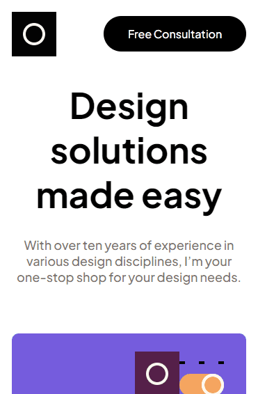

# Desafio Portfolio de Design - Frontend-Mentor

Este é um desafio de um portfolio para um designer, proposto pelo site Frontend-Mentor.

## Tabela de Conteúdos

- [Visão Geral](#visão-geral)
    - [Imagens](#imagens)
    - [Link da página](#link)
- [Processo](#processo)
    - [Linguagens utilizadas](#linguagens-utilizadas)
    - [O que aprendi](#o-que-aprendi)
    - [Possíveis evoluções](#possíveis-evoluções)
- [Autor](#autor)

## Visão-geral

### Imagens

<br>

````
Versão de Desktop
````

   

<br>

````
Versão Mobile
````

 

<br>

````
Versão Tablet
````

 

### Link

- Página no GitHub Pages: <a href="https://julio-mansan2.github.io/design-portfolio/">Clique aqui!</a>

## Processo

### Linguagens utilizadas

<br>

- Marcações semânticas de HTML5
- Propriedades de customização do CSS3
- Estruturas de JavaScript

<br>

### O que aprendi

<br>

- Adicionar uma função para um button com 'onclick':

````html
<button onclick="move(1)"></button>
<button onclick="move(-1)"></button>

````

````javascript

const pictures = document.querySelectorAll('.picture')
var i = 0;

function move (n) {
    if (i === 2 && n > 0) {
        n = 0
    } else if (i === -2 && n < 0) {
        n = 0
    }

    if (n !== 0) {
        i += n
        pictures.forEach (item => item.style.transform = "translateX(" + i * 105.55 + "%)")
    }
}

````

<br>

### Possíveis evoluções

<br>

- Códigos compactos;
- Abdicar do 'onclick', e utilizar a função no próprio 'index.js';

<br>

## Autor

GitHub - <a href="https://github.com/julio-mansan2">julio-mansan2</a> <br>
Front-end Mentor - <a href="https://www.frontendmentor.io/profile/julio-mansan2">julio-mansan2</a> <br>
LinkedIn - <a href="https://www.linkedin.com/in/j%C3%BAlio-a-mansan-3415a7249/">Júlio A.</a> <br>